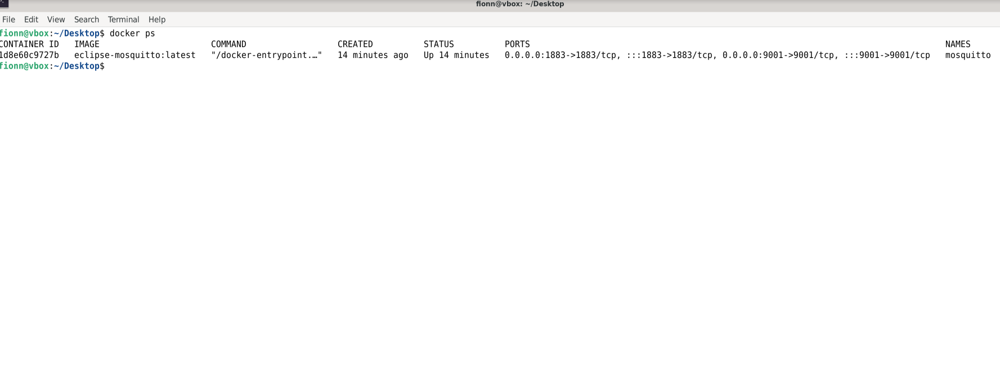
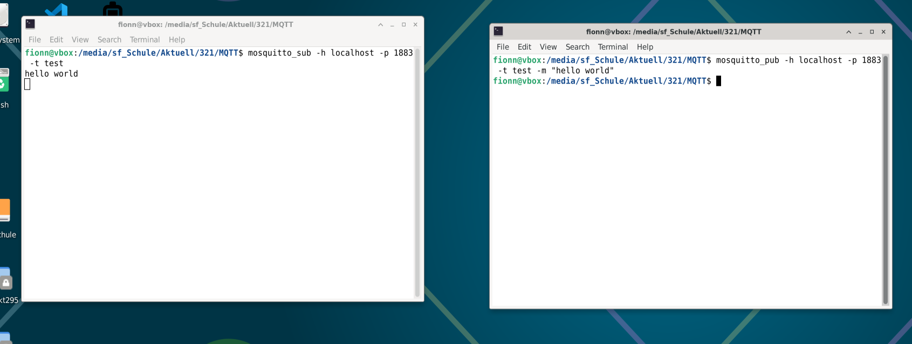
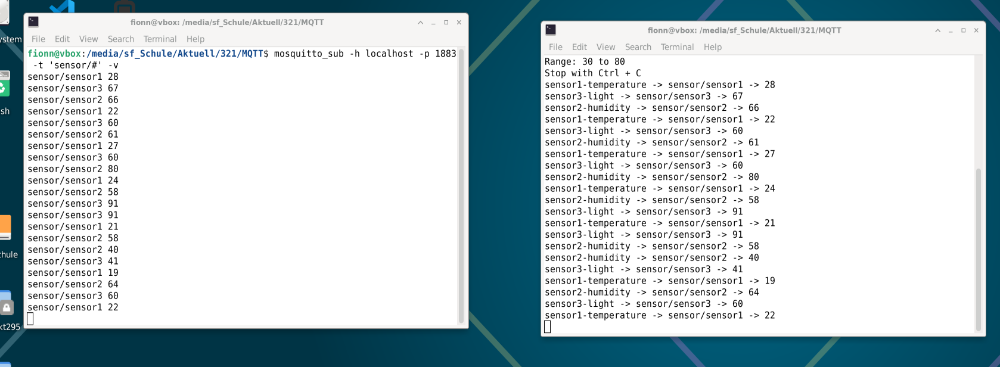
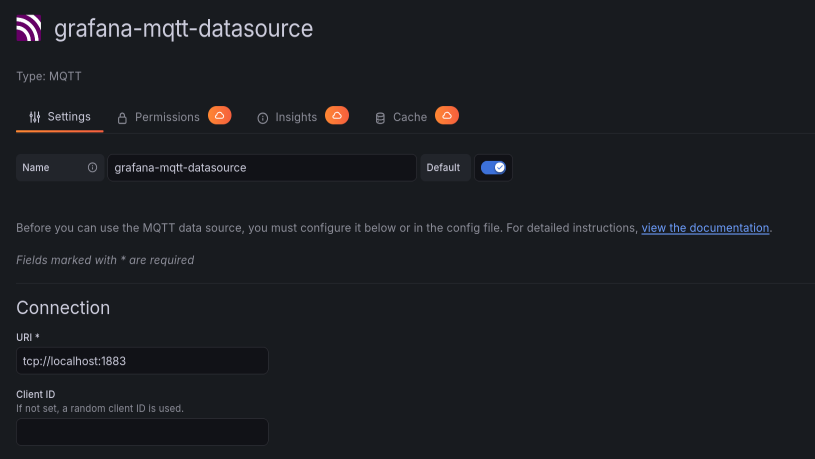
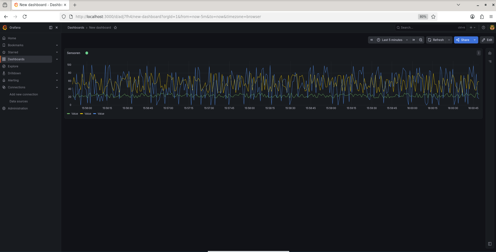

# Modul 321 MQTT Smart Home Monitoring

## Projektbeschreibung

Dieses Repository dokumentiert eine lauffähige Demonstration einer virtuellen Smart-Home Umgebung.

Mehrere Bash-basierte Dummy-Sensoren senden jede Sekunde Zufallswerte an einen MQTT-Broker. Der Broker läuft mit Eclipse Mosquitto in Docker. Grafana empfängt die Daten über das MQTT-Plugin und visualisiert die Sensorwerte live in einem Dashboard.

## Personen

Erstellt von: Fionn Lässer  
Sparing-Partner: Janik Preisig

## Ziel der Demo

Gesucht ist eine funktionierende Smart-Home Umgebung mit:

- mehreren Bash-Sensoren
- MQTT-Broker mit Mosquitto
- MQTT-Topics pro Sensor
- Visualisierung in Grafana
- Grafana MQTT Datasource Plugin

## Systemübersicht

```text
Bash-Sensoren -> Mosquitto MQTT-Broker -> Grafana MQTT Datasource -> Grafana Dashboard
```

## Komponenten

- Debian oder Ubuntu Linux VM
- Docker
- Eclipse Mosquitto MQTT-Broker
- mosquitto-clients
- Grafana
- Grafana MQTT Datasource Plugin
- Bash-Skripte für Dummy-Sensoren

## Repository-Struktur

```text
modul321-mqtt-smart-home-monitoring/
├── README.md
├── docker-compose.yml
├── mosquitto/
│   └── config/
│       └── mosquitto.conf
├── scripts/
│   ├── sensor.sh
│   ├── sensor1.sh
│   ├── sensor2.sh
│   ├── sensor3.sh
│   └── start-all-sensors.sh
├── screenshots/
│   └── README.md
└── docs/
    └── abgabe-notizen.md
```

## 1. Voraussetzungen prüfen

Docker prüfen:

```bash
docker --version
docker compose version
```

Mosquitto Clients prüfen:

```bash
mosquitto_pub --help
mosquitto_sub --help
```

Falls die Mosquitto Clients fehlen:

```bash
sudo apt update
sudo apt install -y mosquitto-clients
```

## 2. Mosquitto MQTT-Broker starten

Den Broker mit Docker Compose starten:

```bash
docker compose up -d
```

Prüfen, ob der Container läuft:

```bash
docker ps
```

Logs anzeigen:

```bash
docker logs mosquitto
```

## 3. MQTT-Broker testen

Terminal 1 öffnen und auf das Topic `test` abonnieren:

```bash
mosquitto_sub -h localhost -p 1883 -t test
```

Terminal 2 öffnen und eine Nachricht senden:

```bash
mosquitto_pub -h localhost -p 1883 -t test -m "hello world"
```

Im ersten Terminal sollte jetzt erscheinen:

```text
hello world
```

## 4. Dummy-Sensoren starten

Alle Sensordaten anzeigen:

```bash
mosquitto_sub -h localhost -p 1883 -t 'sensor/#' -v
```

Sensor 1 starten:

```bash
bash scripts/sensor1.sh
```

Sensor 2 starten:

```bash
bash scripts/sensor2.sh
```

Sensor 3 starten:

```bash
bash scripts/sensor3.sh
```

Alle Sensoren gleichzeitig starten:

```bash
bash scripts/start-all-sensors.sh
```

Die Sensoren senden jede Sekunde Zufallswerte an eigene Topics.

## 5. MQTT Topics

| Sensor | Topic | Wertebereich |
| --- | --- | --- |
| sensor1 | sensor/sensor1 | 18 bis 30 |
| sensor2 | sensor/sensor2 | 30 bis 80 |
| sensor3 | sensor/sensor3 | 0 bis 100 |

## 6. Eigenen Sensor starten

Das Skript `sensor.sh` ist parametrisierbar.

Beispiel:

```bash
bash scripts/sensor.sh wohnzimmer-temp sensor/wohnzimmer/temp 18 30
```

Parameter:

```text
1. Sensorname
2. MQTT-Topic
3. Minimalwert
4. Maximalwert
```

## 7. Grafana installieren

Grafana starten:

```bash
sudo systemctl start grafana-server
sudo systemctl enable grafana-server
```

Im Browser öffnen:

```text
http://localhost:3000
```

Standard-Login:

```text
Benutzername: admin
Passwort: admin
```

## 8. Grafana MQTT Plugin installieren

```bash
sudo /usr/share/grafana/bin/grafana cli --homepath /usr/share/grafana plugins install grafana-mqtt-datasource
sudo systemctl restart grafana-server
```

Prüfen:

```bash
sudo /usr/share/grafana/bin/grafana cli --homepath /usr/share/grafana plugins ls
```

Das Plugin sollte angezeigt werden:

```text
grafana-mqtt-datasource
```

## 9. MQTT Datasource in Grafana einrichten

In Grafana:

```text
Connections
Data sources
Add data source
MQTT auswählen
```

URI eintragen:

```text
tcp://localhost:1883
```

Dann:

```text
Save & test
```

## 10. Dashboard erstellen

In Grafana:

```text
Dashboards
New dashboard
Add visualization
MQTT Datasource auswählen
```

Topic eintragen:

```text
sensor/sensor1
```

Panel-Typ:

```text
Time series
```

Für weitere Sensoren können zusätzliche Panels oder Queries erstellt werden:

```text
sensor/sensor2
sensor/sensor3
```

## 11. Erwartetes Ergebnis

Grafana zeigt live Kurven mit den aktuellen Sensorwerten. Die Werte ändern sich jede Sekunde, weil die Bash-Sensoren fortlaufend Zufallszahlen an den MQTT-Broker senden.

## 12. Screenshots für die Abgabe

## Übersicht

- **docker-ps**

	

- **MQTT Test**

	

- **Sensor Terminal**

	

- **Grafana Datasource**

	

- **Grafana Dashboard**

	


## 13. Fazit

Die virtuelle Smart-Home Umgebung funktioniert. Mehrere Bash-Sensoren senden MQTT-Nachrichten an den Broker. Grafana empfängt diese Daten über das MQTT-Plugin und visualisiert sie live.
