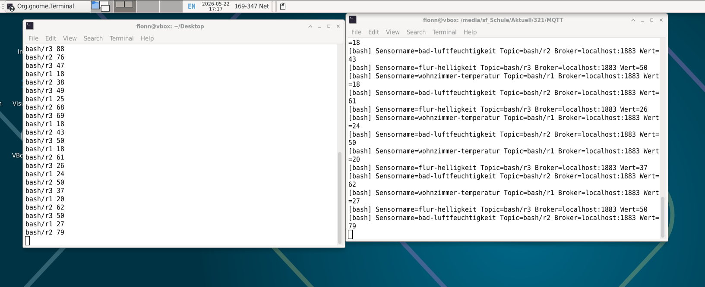
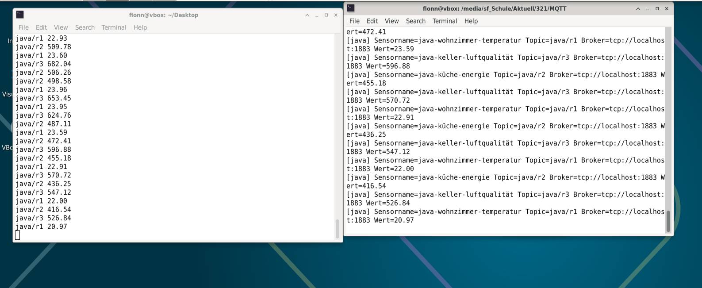
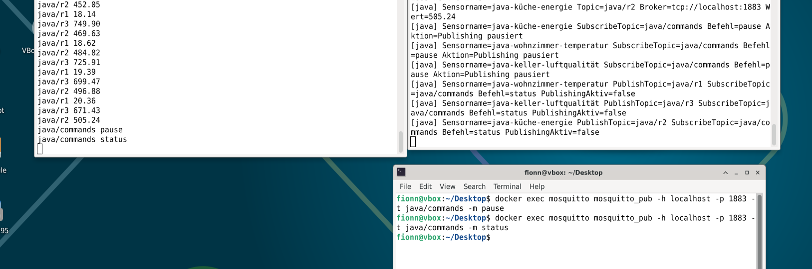
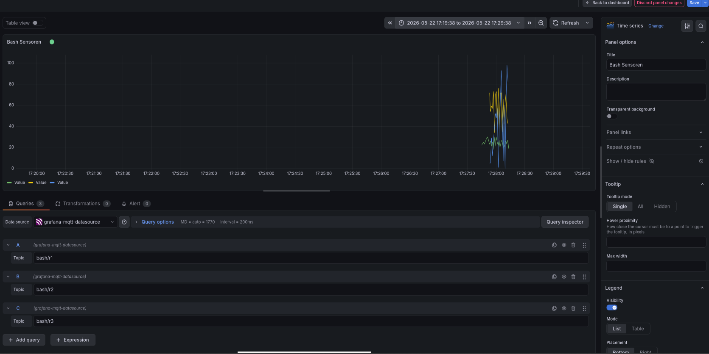
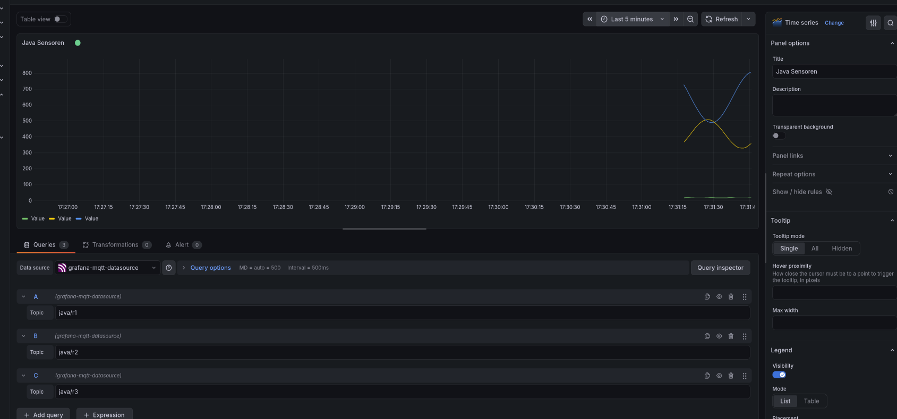
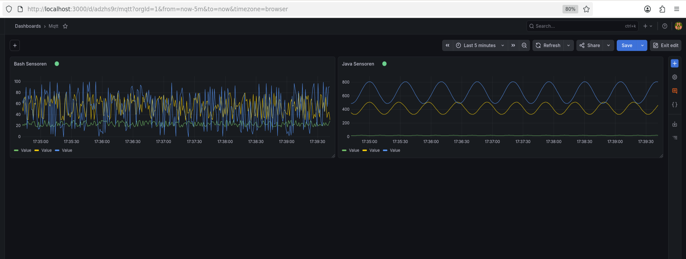

# Screenshot-Nachweise

Diese Datei zeigt die Abgabe-Screenshots direkt im Markdown. Die Bilder belegen die lauffähige MQTT-Demo mit Bash-Sensoren, Java-Sensoren, Java-Subscriber und Grafana.

## 1. Docker Container

`docker-ps.png` zeigt den gestarteten Mosquitto-Container mit den MQTT-Ports `1883` und `9001`.

## 2. MQTT Publish/Subscribe Test

`mqtt-test.png` zeigt einen erfolgreichen MQTT-Test: In einem Terminal läuft `mosquitto_sub`, im anderen Terminal wird mit `mosquitto_pub` eine Nachricht gesendet.

## 3. Bash-Sensoren

`bash-sensor-terminal.png` zeigt die laufenden Bash-Sensoren. Sichtbar sind die Topics `bash/r1`, `bash/r2` und `bash/r3` sowie Sensorname, Broker und Wert.

## 4. Java-Sensoren

`java-sensor-terminal.png` zeigt die laufenden Java-Sensoren. Sichtbar sind die Topics `java/r1`, `java/r2` und `java/r3` sowie Broker und Wert.

## 5. Java-Subscriber

`java-subscriber-command.png` zeigt die Subscriber-Funktionalität der Java-Sensoren. Über das Topic `java/commands` werden Befehle gesendet, und die Java-Anwendung reagiert darauf.

## 6. Grafana MQTT Datasource

`grafana-datasource.png` zeigt die selbst konfigurierte MQTT-Datenquelle in Grafana mit der URI `tcp://localhost:1883`.

## 7. Grafana Bash Panel

`grafana-panel-bash-settings.png` zeigt das Grafana-Panel für die Bash-Daten. Sichtbar sind die drei Topics `bash/r1`, `bash/r2` und `bash/r3`.

## 8. Grafana Java Panel

`grafana-panel-java-settings.png` zeigt das Grafana-Panel für die Java-Daten. Sichtbar sind die drei Topics `java/r1`, `java/r2` und `java/r3`.

## 9. Grafana Dashboard

`grafana-dashboard-bash-java.png` zeigt das fertige Dashboard mit zwei getrennten Panels: links Bash-Daten und rechts Java-Daten.

## Bewertungspunkte

| Kriterium | Nachweis |
| --- | --- |
| Dokumentation formal korrekt aufgebaut | `README.md` und diese Screenshot-Datei sind gegliedert und vollständig. |
| Gesamtsystem verständlich beschrieben | `README.md` beschreibt Bash-Sensoren, Java-Sensoren, MQTT-Broker und Grafana. |
| Setup MQTT verständlich dokumentiert | `README.md` dokumentiert Docker Compose, Mosquitto und den MQTT-Test. |
| BASH Skripte verständlich dokumentiert | `README.md` beschreibt alle Bash-Sensoren und `bash-sensoren/start-all-sensors.sh`. |
| Java-Clients verständlich dokumentiert | `README.md` beschreibt Java Publish-Topics und Subscriber-Commands. |
| Richtige Grafana-Einstellungen | Screenshots 6, 7 und 8 zeigen Datasource und Panel-Topics. |
| Monitoring funktioniert für BASH und JAVA | Screenshot 9 zeigt beide Grafana-Panels mit Daten. |
| Subscription Mechanismus in Java funktioniert | Screenshot 5 zeigt Commands auf `java/commands` und die Reaktion der Java-App. |
